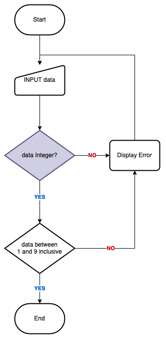

# Week 06

## Demonstration: Validating User Input

Create a flowchart that shows the algorithm for:

- Asking the user for an input.
- The input must be an integer between 1 and 9 inclusive.
- If the user submits an invalid value, then an error 
  message must be displayed.

The above will be implemented using JavaScript and a small HTML5 
based web page.
